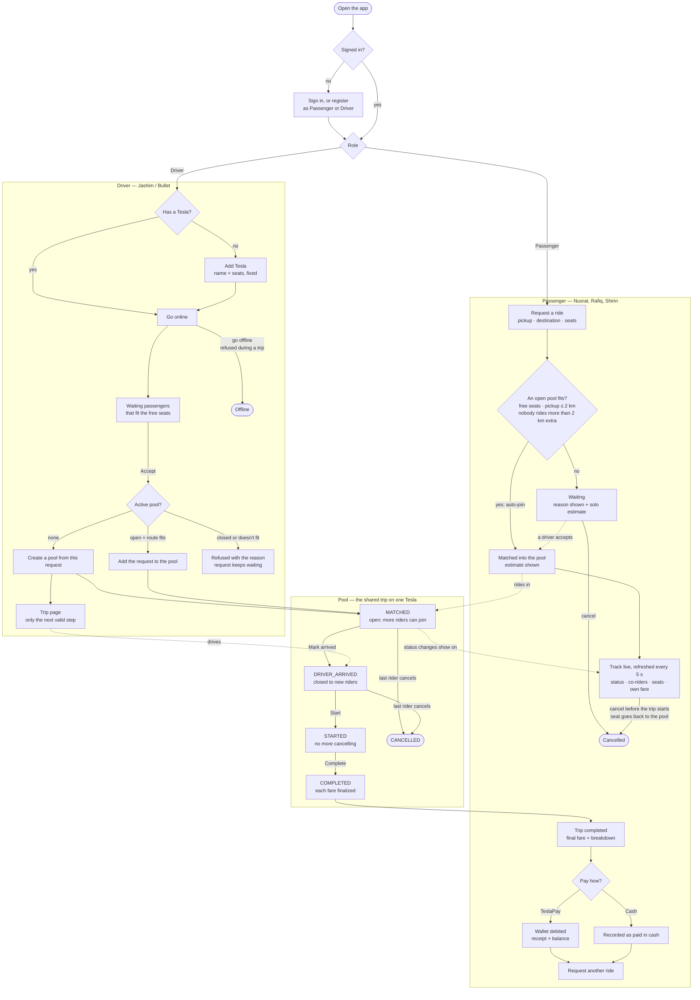
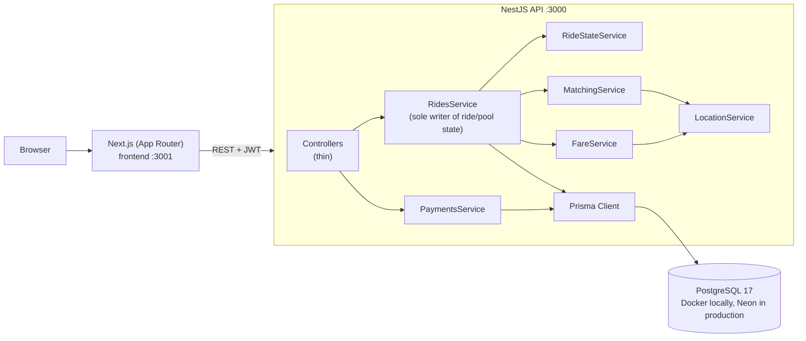
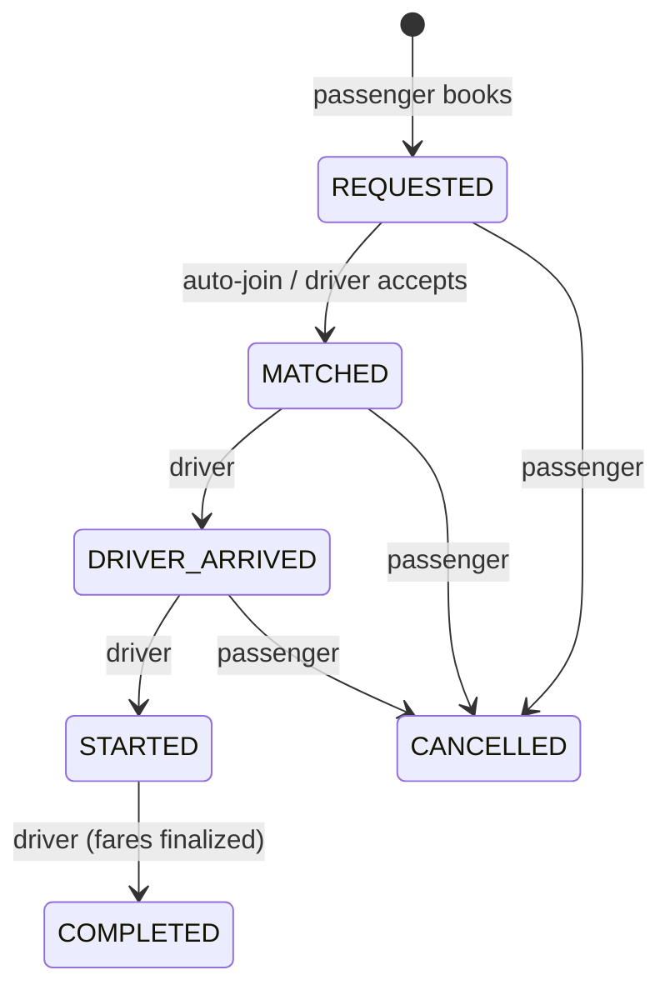
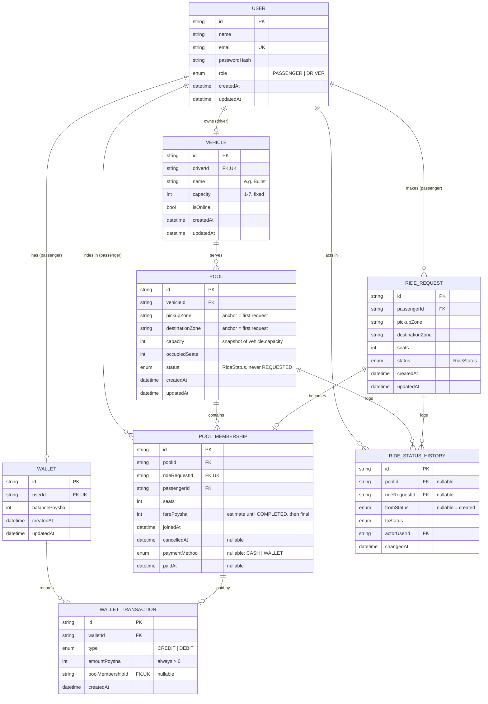
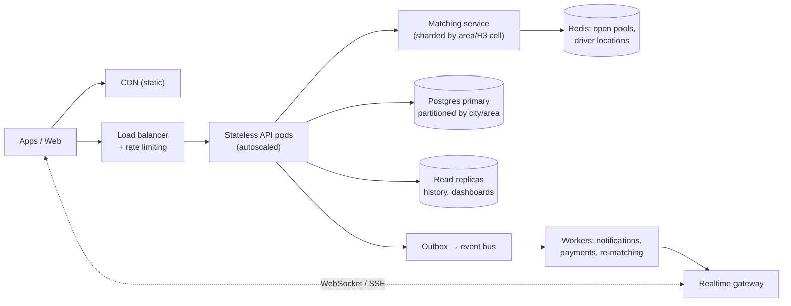

# Dhaka Tesla Pool

A ride-pooling MVP for one very specific Tesla: Jashim's 3-seat **Bullet** in Banani. Passengers
book a ride, get pooled into a car already heading their way (or wait for a driver to accept),
each pays their **own** fare, and **two people can never take the same last seat**.

Built for the RoBenDevs internship challenge.

| | |
|---|---|
| **Live demo** | https://dhaka-tesla-pool.vercel.app (sign in with the [demo credentials](#demo-credentials)) |
| **Live API** | https://dhaka-tesla-pool-api.onrender.com/health |
| **Demo video (≤ 6 min)** | _TODO: Loom link_ |
| **Run it locally** | `docker compose up --build` → http://localhost:3001 ([details](#quick-start-docker)) |

> **First load can take ~50 s.** The API runs on Render's free tier, which sleeps after 15 minutes
> idle. Open the [health URL](https://dhaka-tesla-pool-api.onrender.com/health) first to wake it.

---

## Contents
[Problem](#problem) · [Features](#features) · [User flow](#user-flow) · [Screenshots](#screenshots) ·
[Architecture](#architecture) · [ERD](#database-erd) · [Tech stack](#tech-stack) ·
[Structure](#project-structure) · [Setup](#getting-started) · [Deployment](#deployment) · [Tests](#tests) ·
[Demo credentials](#demo-credentials) · [API](#api-overview) ·
[Matching & fares](#matching-and-fares) · [Key decisions](#key-decisions--trade-offs) ·
[Concurrency](#concurrency-the-last-seat) · [Limitations](#known-limitations) ·
[Next](#next-improvements) · [If Oi Tesla goes viral](#bonus-if-oi-tesla-goes-viral) ·
[AI usage](#ai-usage)

## Problem

8:41 AM, Banani. Nusrat books a ride to Mohakhali. Two minutes later Rafiq books a route that
overlaps hers but isn't the same (Gulshan 1). Thirty seconds later Shirin tries to grab the last
seat. The system has to:

- decide **who can share** a car without taking anyone far out of their way;
- **never** exceed the car's capacity, even when two requests arrive at the same instant;
- charge **each passenger their own fare**, not the pool's total split evenly;
- move every ride through a **clear lifecycle** and reject anything out of order.

## Features

| Passenger (Nusrat, Rafiq, Shirin) | Driver (Jashim / Bullet) |
|---|---|
| Register / sign in | Register / sign in, add a Tesla (capacity 1–7, fixed) |
| Request a ride: pickup zone, destination zone, seats | Go online / offline (can't go offline mid-trip) |
| Auto-join a compatible pool, or wait — with the reason shown | See waiting requests that fit the free seats; accept them |
| Live ride status (5 s polling): waiting → matched → in progress → completed | Accepting creates the pool, or adds to the open pool |
| Co-riders' first names, seats used (`● ● ○ 2 / 3`) | Mark arrived → start → complete (only the valid next step) |
| Own fare with breakdown, labelled *estimate* until *final* | Every passenger's own fare + breakdown |
| Cancel before the trip starts (seat goes back to the pool) | |
| Pay by cash or simulated **TeslaPay** wallet; ride history | |

Every screen that fetches data has loading, empty and error states. Errors are shown by API
error code, never by raw message.

## User flow

What each person can do, the choices along the way, and how the shared pool connects them.
Diamonds are decisions: the user's, or the system's (matching, capacity).



| Choice | Who | Options |
|---|---|---|
| Account type | anyone | Passenger or Driver (at registration) |
| Trip | passenger | Pickup and destination from 9 Dhaka zones; 1–7 seats |
| Stay or leave | passenger | Cancel while waiting, matched or driver arrived; not once started |
| Payment | passenger | TeslaPay wallet or cash, after the trip completes |
| Availability | driver | Online or offline (offline is refused during an active trip) |
| Who to take | driver | Accept any waiting request that fits; the first accept creates the pool, later ones add to it |
| Trip progress | driver | Arrived → start → complete, one step at a time |

## Screenshots

_TODO: add screenshots or GIFs to `assets/screenshots/` and link them here._

| Passenger: request + waiting | Passenger: pooled ride + fare | Driver: dashboard | Driver: trip controls |
|---|---|---|---|
| _TODO_ | _TODO_ | _TODO_ | _TODO_ |

## Architecture



- **Controllers are thin**: validate the DTO, call one service method.
- **Deciders are pure**: `MatchingService`, `FareService`, `RideStateService` and
  `LocationService` take plain data and return a decision. They never touch the database, so
  they're unit-tested without one.
- **One writer**: `RidesService` is the only code that writes rides and pools, always in one
  transaction with row locks. `PaymentsService` writes only the payment columns and the wallet tables.

```
POST /ride-requests
  → RideRequestsController   validate, call the service
  → RidesService             owns the transaction
      ├─ MatchingService     "fits Jashim's pool, worst extra 1.63 km"
      ├─ FareService         "estimate 6880 poysha"
      ├─ RideStateService    "REQUESTED → MATCHED is allowed"
      └─ Prisma              lock the pool row, add membership + seats atomically
```

### Ride lifecycle

`RideRequest.status` (one passenger's booking) and `Pool.status` (the trip) use the same enum.



- A pool is created at `MATCHED` when a driver accepts, and is never `REQUESTED`.
- A pool transition moves every active member's request with it, in the same transaction.
- A pool auto-cancels when its last active member cancels.
- Anything else → `409 INVALID_TRANSITION`.

UI labels: `REQUESTED` = waiting · `MATCHED` / `DRIVER_ARRIVED` = matched / driver arrived ·
`STARTED` = in progress · `COMPLETED` = completed · `CANCELLED` = cancelled.

## Database (ERD)



| Table | Why it exists |
|---|---|
| `User` | One table with a `role` enum. Nobody in the brief needs to be both passenger and driver. |
| `Vehicle` | One per driver (`driverId` unique); capacity fixed at creation. |
| `RideRequest` | A booking, whether or not it's ever matched. Carries the passenger-facing status. |
| `Pool` | One trip on one car. `capacity` is **copied** from the vehicle so a plain `CHECK` can guard seats. |
| `PoolMembership` | Request ↔ pool link and the **only place a fare is stored**, one row per booking. Cancels set `cancelledAt` rather than deleting. |
| `RideStatusHistory` | Append-only log of every status change: who, from, to, when. |
| `Wallet` / `WalletTransaction` | Simulated TeslaPay. Append-only CREDIT/DEBIT rows; the balance is a cached sum. |

**Constraints the database enforces** (added as raw SQL in the init migration, since Prisma can't express them):
- `CHECK (occupiedSeats <= capacity)`;
- one active pool per vehicle, as a partial unique index;
- one active request per passenger, as a partial unique index;
- balance `>= 0`, positive amounts and seats, pickup ≠ destination;
- unique `PoolMembership.rideRequestId` and unique `WalletTransaction.poolMembershipId` (no double wallet payment).

## Tech stack

Next.js, a Node.js backend and a database were required by the brief. Everything else is a choice:

| Area | Choice | Alternatives | Why for this MVP | Switch when |
|---|---|---|---|---|
| Frontend | **Next.js 16** (App Router), React 19 | Vite + React SPA, Remix | Recommended by the brief; file-based routes; `standalone` output makes a small Docker image | Never for this size; a pure SPA would also do |
| Styling | **Tailwind CSS v4**, no component library | shadcn/ui, MUI | A small monochrome design system (`globals.css` tokens + 5 components) is all the UI needs; nothing to justify or upgrade | A real product design system |
| Live updates | **5 s polling** | WebSockets, SSE | Simplest thing that makes the ride board feel live; no extra infra | Many concurrent riders, or sub-second updates needed |
| Backend | **NestJS 12** (Express) | Express, Fastify | Modules, DI and guards give the service split (deciders vs one writer) a clear home; global guard/filter/pipe for auth, errors and validation | Only if raw throughput mattered: Fastify adapter |
| Database | **PostgreSQL 17** | MySQL, MongoDB | Relational integrity is the core problem: row locks (`FOR UPDATE`), `CHECK`s and partial unique indexes | Doesn't change; scale with replicas/partitioning |
| ORM | **Prisma 7** (+ `@prisma/adapter-pg`) | TypeORM, Drizzle, Knex | Typed client, readable schema, migrations. Row locks use `$queryRaw` inside interactive transactions | Heavy raw SQL needs: Drizzle or Kysely |
| Validation | **class-validator** DTOs | Zod | Native to Nest's `ValidationPipe`; errors mapped to `400 VALIDATION_ERROR` | Sharing schemas with the frontend: Zod |
| Auth | **JWT** (Bearer) + **bcryptjs** | Sessions, Auth.js, argon2 | Stateless and simple; Bearer header means no CSRF. bcryptjs is pure JS, so there's no native build in Alpine | Production: httpOnly cookie + refresh tokens, argon2 |
| Tests | **Jest 30** + supertest against a **real Postgres** | Vitest, mocked Prisma | Locking and constraints can only be proven on a real database | — |
| Containers | **Docker Compose** (multi-stage images) | Kubernetes | One command runs db + API + web on any machine | Multi-service production: ECS / Kubernetes |
| Hosting | **Vercel** (web) · **Render** (API, Docker) · **Neon** (Postgres) | Railway, Fly.io, Koyeb; Supabase for the DB | All free with no card. Render runs the same backend Dockerfile as compose; Vercel builds Next.js natively; Neon gives a pooled URL for the app and a direct one for migrations | Cold starts matter: a paid always-on instance, or one cloud provider (e.g. AWS) |

## Project structure

```
Dhaka-Tesla-Pool/
├── docker-compose.yml          # db + backend + frontend
├── .env.example                # values compose passes to the containers
├── backend/                    # NestJS API
│   ├── prisma/                 # schema.prisma, migrations/ (+ raw SQL constraints), seed.ts
│   ├── prisma.config.ts        # Prisma 7 CLI config (migrations use DIRECT_URL)
│   ├── src/
│   │   ├── common/             # JWT + roles guards, error filter, DomainException, decorators
│   │   ├── prisma/             # PrismaService (pg driver adapter)
│   │   └── modules/
│   │       ├── auth/           # register, login, me
│   │       ├── vehicles/       # create, online/offline
│   │       ├── location/       # Dhaka zones + Haversine
│   │       ├── fares/          # FareService (pure)
│   │       ├── rides/          # RidesService (writer), matching + state machine (pure), 2 controllers
│   │       ├── payments/       # cash / wallet, /wallet/me
│   │       └── health/         # GET /health (checks the DB)
│   ├── test/                   # e2e: last-seat race + ride rules (real Postgres)
│   └── Dockerfile
└── frontend/                   # Next.js app
    ├── app/                    # (auth)/login|register, passenger/{dashboard,request,history}, driver/{dashboard,ride/[poolId]}
    ├── components/             # ui/ (Button, Field, Card, StatusBadge…), ride/, forms/, app-shell
    ├── hooks/use-api.ts        # fetch + 5 s polling
    ├── lib/                    # api-client, session (JWT), types, errors, format, zones
    └── Dockerfile
```

## Getting started

**Prerequisites:** Docker Desktop. For running without Docker: Node.js 22 and npm.

### Quick start (Docker)

```bash
docker compose up --build
```

| Service | URL | Notes |
|---|---|---|
| Frontend | http://localhost:3001 | Next.js standalone server |
| API | http://localhost:3000 | Runs `prisma migrate deploy` → seed → start. `GET /health` |
| Postgres | localhost:5432 | user / password / db: `tesla` / `tesla` / `tesla_pool` |

All three have health checks. A fresh clone works without a `.env` because every variable has
a local default. To start over with an empty database: `docker compose down -v`.

### Local development

```bash
docker compose up -d db                      # just Postgres

cd backend
cp .env.example .env
npm install
npx prisma migrate deploy                    # or `migrate dev` when changing the schema
npx prisma db seed
npm run start:dev                            # http://localhost:3000

cd ../frontend                               # second terminal
cp .env.example .env.local
npm install
npm run dev                                  # http://localhost:3001
```

### Environment variables

Never commit real secrets. Every `.env.example` holds local-only values.

| Variable | Where | Purpose |
|---|---|---|
| `DATABASE_URL` | backend | Connection the running app uses (a pooled URL on Neon) |
| `DIRECT_URL` | backend | Direct connection for migrations (`prisma.config.ts`) |
| `JWT_SECRET` | backend, root | JWT signing key. **Set a long random value anywhere but your machine** |
| `JWT_EXPIRES_IN` | backend, root | Token lifetime, e.g. `1d` |
| `FRONTEND_ORIGIN` | backend, root | The one browser origin allowed by CORS (default `http://localhost:3001`) |
| `PORT` | backend | API port (default `3000`) |
| `NEXT_PUBLIC_API_URL` | frontend, root | API URL **as the browser sees it**. Baked in at build time, so rebuild after changing it |
| `POSTGRES_USER` / `_PASSWORD` / `_DB` | root | The compose Postgres container |

Files: `backend/.env.example`, `frontend/.env.example`, and the root `.env.example` (read by
compose). `backend/.env.test` is committed on purpose: it only points at the local
`tesla_pool_test` database.

### Migrations and seed

- `prisma/migrations/…_init` is Prisma's generated SQL **plus** hand-added `CHECK`s and partial
  unique indexes. Check any future generated migration doesn't drop them.
- The container runs `migrate deploy` (applies committed migrations, never generates new ones)
  and then the seed.
- The seed is **idempotent** (upsert by email), so it's safe on every restart. It creates Jashim
  with Bullet (3 seats, offline), and Nusrat, Rafiq and Shirin, each with a ৳500 wallet. No rides
  are seeded.

## Deployment

Everything runs on free tiers, with no card needed.

| Part | Host | Settings |
|---|---|---|
| Frontend | **Vercel** | Root directory `frontend`, Next.js preset. Env: `NEXT_PUBLIC_API_URL=https://dhaka-tesla-pool-api.onrender.com` |
| API | **Render** web service (Docker) | Root directory `backend` (uses `backend/Dockerfile`), health check `/health`. Env: `DATABASE_URL`, `DIRECT_URL`, `JWT_SECRET`, `JWT_EXPIRES_IN`, `FRONTEND_ORIGIN=https://dhaka-tesla-pool.vercel.app` |
| Database | **Neon** Postgres (Singapore) | `DATABASE_URL` = the pooled connection string (`-pooler` host); `DIRECT_URL` = the direct one, used for migrations |

- **Migrations and seed run by themselves.** Every Render start runs `prisma migrate deploy`, then the
  idempotent seed, then the API. There's no manual database step.
- **Cold start:** Render's free service sleeps after 15 minutes idle. The first request then takes
  about 50 s while it wakes; after that it's fast. Neon also suspends when idle and wakes in about a second.
- **CORS allows exactly one origin.** `FRONTEND_ORIGIN` must equal the Vercel production URL:
  https, no trailing slash. A mismatch shows up in the app as "Can't reach the server".
- **`NEXT_PUBLIC_API_URL` is baked in at build time.** After changing it, redeploy on Vercel.

**Redeploying**
- Pushing to the deployed branch redeploys both Render and Vercel automatically.
- By hand: Render → Manual Deploy → Deploy latest commit; Vercel → Deployments → ⋯ → Redeploy.
- Changing an environment variable needs a redeploy on both hosts. Render offers "Save, rebuild, and deploy".
- A clean demo database: in Neon, reset the branch (or delete the ride, pool and history rows), then
  redeploy on Render so it migrates and seeds again.

## Tests

```bash
cd backend
npm test                                                   # unit: pure deciders, no DB
docker compose exec db createdb -U tesla tesla_pool_test   # once, from the repo root
npm run test:e2e                                           # e2e: real Postgres, migrates the test DB first
npm run lint                                               # (frontend: npm run lint)
```

The tests cover what's risky, not a coverage number:

| Brief requirement | Test |
|---|---|
| Bullet's capacity can never be exceeded | **e2e race** (10 runs): Nusrat and Shirin request Bullet's last seat at the same instant. Exactly one gets `MATCHED`, the other stays waiting with `CAPACITY_EXCEEDED`, and `occupiedSeats = 3` |
| Invalid state transitions are rejected | Unit: every legal and illegal transition. e2e: start before arrived, completing twice, cancelling after start |
| Nusrat's and Rafiq's pooled fares are correct | Unit: 7200 / 6880 / 10880 poysha and Nusrat's 9000 solo estimate. e2e: 9000 estimate → 7200 final |
| Users can't modify another user's ride | e2e: Rafiq can't read, cancel or pay Nusrat's ride; Karim (a test-only second driver) can't see or move Jashim's pool; a passenger can't use driver routes |
| Cancellation rules hold | e2e: the seat is released, the last member leaving cancels the pool, a waiting request can be cancelled |
| Concurrent requests can't corrupt capacity | The same race test; the DB `CHECK` is the backstop |
| Payments | e2e: double payment rejected; an uncovered wallet payment is rejected and rolled back |
| Matching | Unit: the worked example, a scenario table (accept/reject), and the same answer whichever passenger booked first |

The e2e helper refuses to truncate any database whose URL doesn't contain `_test`.

## Demo credentials

Password for everyone: **`password123`**

| Who | Email | Role | Notes |
|---|---|---|---|
| Jashim | `jashim@teslapool.dev` | Driver | Owns **Bullet**, 3 seats, starts offline |
| Nusrat | `nusrat@teslapool.dev` | Passenger | ৳500 TeslaPay |
| Rafiq | `rafiq@teslapool.dev` | Passenger | ৳500 TeslaPay |
| Shirin | `shirin@teslapool.dev` | Passenger | ৳500 TeslaPay |

**Demo script.** Use a separate browser or profile per person, because the session is stored per browser.
1. Jashim goes online.
2. Nusrat books Banani → Mohakhali. She waits: "No Tesla is taking passengers yet".
3. Jashim accepts, which creates the pool. Nusrat's estimate is ৳90.00.
4. Rafiq books Banani → Gulshan 1 and **auto-joins**. Nusrat's estimate drops to ৳72.00 with the pool discount.
5. Shirin books Banani → Farmgate and takes the **last seat** (3 / 3).
6. Jashim marks arrived, starts and completes the trip. Final fares: **৳72.00 / ৳68.80 / ৳108.80**.
7. Each passenger pays by cash or TeslaPay.

## API overview

REST + JSON. Every route needs `Authorization: Bearer <jwt>` except register, login and health.
Money is always **integer poysha**; zones are codes like `BANANI` and `GULSHAN_1`.

| Method & path | Role | Purpose |
|---|---|---|
| `POST /auth/register`, `POST /auth/login` | public | Returns `{ accessToken, user }`. New passengers get a wallet |
| `GET /auth/me` | any | Current user |
| `POST /vehicles`, `GET /vehicles/me`, `PATCH /vehicles/me/status` | driver | Create the Tesla, view it + its active pool, go online/offline |
| `POST /ride-requests` | passenger | Book; auto-joins an open pool if one fits. Always `201`: `pool` + estimate, or waiting + `matchResult.reason` |
| `GET /ride-requests/me`, `GET /ride-requests/:id` | passenger | Own history; one request with membership, fare and pool summary |
| `PATCH /ride-requests/:id/cancel` | passenger (owner) | Cancel before `STARTED`; releases seats |
| `GET /ride-requests/pending` | driver | Waiting requests that fit the free seats |
| `PATCH /ride-requests/:id/accept` | driver | Create a pool, or join the request into the open one |
| `GET /pools/:id`, `/pools/:id/history`, `/pools/:id/fares` | pool's driver or member | Pool view (the driver sees all, a passenger sees co-riders' first names), status log, fare breakdowns |
| `PATCH /pools/:id/arrived \| start \| complete` | pool's driver | Lifecycle; `complete` finalizes fares |
| `POST /payments/:poolMembershipId` | passenger (owner) | `{ method: "CASH" \| "WALLET" }`, only after `COMPLETED` |
| `GET /wallet/me` | passenger | Balance + the last 20 transactions |
| `GET /health` | public | `{ status: "ok", db: "ok" }` or `503` |

**Errors** always look like `{ "statusCode": 409, "error": "CAPACITY_EXCEEDED", "message": "…" }`.
The frontend switches on `error`, never on `message`. The codes are:
- `VALIDATION_ERROR`, `UNAUTHORIZED`, `FORBIDDEN`, `NOT_FOUND`;
- `EMAIL_TAKEN`, `VEHICLE_EXISTS`, `VEHICLE_OFFLINE`, `ACTIVE_POOL_EXISTS`, `ACTIVE_REQUEST_EXISTS`;
- `INVALID_TRANSITION`, `CAPACITY_EXCEEDED`, `PICKUP_TOO_FAR`, `EXTRA_DISTANCE_TOO_HIGH`;
- `PAYMENT_NOT_ALLOWED`, `ALREADY_PAID`, `INSUFFICIENT_FUNDS`, `INTERNAL_ERROR`.

**Authorization** has two layers. A global JWT guard plus `@Roles()` checks the role. Ownership
is checked in the service, **inside the same transaction as the write**, and never trusts IDs
the client sends.

## Matching and fares

**Geography.** Nine fixed Dhaka zones (Banani, Gulshan 1/2, Mohakhali, Farmgate, Dhanmondi,
Mirpur 10, Uttara, Bashundhara), each with a lat/lng. Distance is Haversine, i.e. a straight line.
There's no maps API, as the brief suggests.

**Matching rule: no passenger rides more than 2 km further than they would alone.**
`MatchingService.canJoinPool` checks, in this order:
1. the pool is open (`MATCHED`);
2. the seats fit;
3. the pickup is ≤ 2 km from the pool's first pickup;
4. the worst extra distance is ≤ 2 km. It tries every drop-off order (at most 3! = 6 for Bullet)
   and keeps the order with the smallest worst extra. Existing members count too.

The score is `pickup distance + worst extra`; the lowest wins.

| Nusrat's pool Banani → Mohakhali, then… | Worst extra | Result |
|---|---|---|
| Rafiq Banani → Gulshan 1 (drop Rafiq first) | 1.63 km | ✅ match |
| Shirin Banani → Farmgate (pool = Nusrat + Rafiq) | 1.63 km | ✅ match |
| Banani → Uttara (opposite direction) | 3.59 km | ❌ `EXTRA_DISTANCE_TOO_HIGH` |

**Fare:** `fare = (base + distanceCharge − poolDiscount) × seats`, computed per passenger from
**their own** pickup → destination.
- Base ৳50, ৳20 per km, and a 20% pool discount when the pool has ≥ 2 bookings.
- Distance is rounded to **0.1 km** so a fare can be checked by hand.

| Passenger | Direct km | Priced km | Base | Distance | Discount | **Fare** |
|---|---|---|---|---|---|---|
| Nusrat | 1.972 | 2.0 | ৳50.00 | ৳40.00 | −৳18.00 | **৳72.00** |
| Rafiq | 1.794 | 1.8 | ৳50.00 | ৳36.00 | −৳17.20 | **৳68.80** |
| Shirin | 4.347 | 4.3 | ৳50.00 | ৳86.00 | −৳27.20 | **৳108.80** |

The fare is stored at join as an estimate, and recomputed for everyone inside the `complete`
transaction as the final fare. The UI shows the estimate for who is in the pool *right now*,
labelled "Estimated", and after completion the stored final fare, labelled "Final".

## Key decisions & trade-offs

| Decision | Why | Trade-off |
|---|---|---|
| **Accepting creates the pool** (a pool is never `REQUESTED`) | The brief's "matched/accepted" is one event; a pool with no car makes no sense | Waiting requests aren't re-matched in the background; a driver accepting them is what pools them |
| **2 km absolute extra-distance rule** | Every trip here is ~2 km, so a percentage detour rejects everything. Checking every drop-off order makes the result independent of booking order | Straight-line km, not road km |
| **Price in 0.1 km steps** | Fares can be verified by hand (the brief asks for this) | Up to ±0.05 km of rounding per trip |
| **Integer poysha, not decimal taka** | Exact arithmetic, no float drift; the same pattern as Stripe's cents | Format only at display (`formatTaka`) |
| **Pessimistic `SELECT … FOR UPDATE`, not an optimistic `version` column** | Two riders racing for the last seat is the *expected* case; optimistic locking would need a retry loop and the loser still loses | Joins on one pool are serialized; fine, since a pool has ≤ 7 seats |
| **Capacity copied onto the pool** | Lets a one-table `CHECK (occupiedSeats <= capacity)` back up the lock, with no trigger | A denormalized copy, safe because vehicle capacity never changes |
| **Pure deciders + one writer service** | Matching, fares and transitions are unit-tested without a DB; all state changes in one place | More files than a single service |
| **JWT in localStorage** | Simple; the Bearer header means no CSRF | Readable by injected scripts (XSS). Upgrade: httpOnly cookie |
| **Polling every 5 s** | No socket infrastructure; easy to reason about | Up to 5 s of lag; more requests than push |

**Assumptions**
- A passenger who auto-joins an accepted pool needs no second approval from the driver.
- A pool closes to new passengers at `DRIVER_ARRIVED`.
- `DRIVER_ARRIVED` means "at the pool's first pickup".
- Anyone can register as a driver.
- There's no cancellation fee.

## Concurrency: the last seat

**The problem.** Bullet has 1 seat left. Nusrat and Shirin both see it free and book at the same instant.

**How it's handled.** Each join attempt is one Postgres transaction:
1. `SELECT … FROM "Pool" WHERE id = $1 FOR UPDATE`. The second transaction **waits here**.
2. **Re-read** status, seats and members *after* the lock, and re-run `MatchingService` on that snapshot.
3. Conditional update `RideRequest … WHERE status = 'REQUESTED'`, insert the membership, then `occupiedSeats += seats`.
4. Commit. The waiting transaction now sees 3 / 3, fails the re-check, and its request stays
   waiting with `CAPACITY_EXCEEDED`.

**Other races covered the same way:**
- Two accepts of one request: the conditional update.
- A second pool on one car: the vehicle row lock plus the partial unique index.
- Go offline vs accept: the vehicle row lock.
- Cancel vs start: the pool lock.
- Double payment: `paidAt IS NULL` plus the unique wallet transaction.

The lock order is always Vehicle → Pool → RideRequest, so there are no deadlocks.
**Backstops:** even if the application code were wrong, the `CHECK` and unique indexes make the
database refuse. The race test runs 10 times against a real Postgres.

**What changes at scale:**
- Contention on a single pool row stays tiny, because a pool has a handful of seats.
- The bottleneck moves to **matching reads** across many pools. Fixes:
  - geospatial candidate search;
  - partitioning by area;
  - `FOR UPDATE SKIP LOCKED`, so competing joins spread across candidate pools instead of queueing on one.
- **Idempotency keys** on booking and payment make client retries safe.

## Known limitations

- Distances are straight lines between zone centres, not roads. Only 9 zones.
- Pickups are visited in join order; `DRIVER_ARRIVED` covers the whole pool (the first pickup).
- Vehicles have no live location, so the pending list isn't filtered by distance.
- Waiting requests never expire; there's no background re-matching.
- No driver-side cancellation; a driver can't go offline with an active pool.
- An estimate can differ from the final fare, e.g. when a co-rider joins or cancels.
- Cash is recorded, not confirmed. No wallet top-up. The driver isn't credited.
- Anyone can register as a driver. Another user's resource ID returns 403, which reveals it exists (IDs are random UUIDs).
- The JWT is in `localStorage`, which XSS could read. No refresh tokens.
- Updates come by 5 s polling, not push.

## Next improvements

1. Server-sent events or WebSockets for ride updates, replacing polling.
2. Idempotency keys on `POST /ride-requests` and `POST /payments/:id`.
3. httpOnly cookie sessions + refresh tokens; rate limiting on auth.
4. Driver earnings: credit the driver's side on payment, plus payouts.
5. Request expiry + background re-matching of waiting requests.
6. Real road distances (OSRM or a routing API) behind `LocationService`, the only piece that would change.
7. Per-passenger pickup tracking, and driver-side cancellation with rules.
8. CI: GitHub Actions running lint, unit and e2e tests against a Postgres service; Playwright tests for the UI.

## Bonus: if Oi Tesla goes viral

*1M passengers, 100k drivers. This is reasoning, not something built in the MVP.*



| Concern | Approach |
|---|---|
| Load balancing, horizontal scale | Stateless API (JWT) behind a load balancer, autoscaled on CPU and latency. Static assets on a CDN |
| DB indexing / replicas | Keep the hot-path indexes (status, vehicle+status, passenger+createdAt). Send history and dashboards to read replicas. Use a connection pooler (PgBouncer/Neon) |
| DB contention | Short transactions; one pool row per join; `SKIP LOCKED` across candidate pools; partition by city/area so hot zones don't share locks |
| Geospatial search | PostGIS or H3 cells replace the 9-zone list. Candidate pools come from nearby cells, and drivers stream live locations |
| Matching | A matching service sharded by area; short batching windows (1–2 s) to pool better; still validated by the locked re-check at join |
| Caching | Redis for open-pool snapshots and driver locations (short TTL). The database stays the source of truth for seats |
| Queues / events | Transactional outbox: state changes are written with an event row, and workers publish them for notifications, receipts, analytics and re-matching |
| Real-time | A WebSocket/SSE gateway pushes status changes; mobile push notifications; polling removed |
| Rate limiting | Per user and IP at the gateway; tighter limits on booking, login and payment |
| Idempotency | An `Idempotency-Key` on booking and payment, stored with the result, so a retry returns the same answer |
| Retry / failure | Retry deadlocks and serialization failures with backoff. Idempotent workers, dead-letter queues. Payment-gateway webhooks with daily reconciliation |
| Observability | Structured logs with request IDs; metrics for match rate, lock wait, p95 latency and seat utilization; OpenTelemetry traces; SLO alerts |
| Security | httpOnly cookies + refresh tokens, driver KYC and vehicle verification, secrets in a manager, least-privilege DB roles, audit log (`RideStatusHistory` already exists) |
| Deployment | Containers on ECS or Kubernetes, blue-green or canary releases, expand/contract migrations, infrastructure as code |

## AI usage

_TODO: fill in; this is graded on engineering understanding, not on how little AI was used._

**Tools**
- _TODO: which tools, and what each was used for (design review, code generation, tests, docs, debugging)._

**One suggestion I accepted**
- _TODO: what was suggested, why I kept it, and how I verified it._

<!-- Candidates from this project's history, if they match your experience:
     - pessimistic FOR UPDATE + re-check after the lock (vs an optimistic version column)
     - copying capacity onto Pool so a single-table CHECK can back up the lock -->

**One suggestion I rejected or changed**
- _TODO: what was suggested, what was wrong with it, and what I did instead._

<!-- Candidates:
     - the first matching draft ("detour ≤ 20% of the pool's route") rejected Nusrat + Rafiq
       (83%) and depended on booking order → replaced by the 2 km absolute rule over all drop-off orders
     - installing Prisma's `latest` tag pulled an 8.0 release candidate → pinned to 7.10 -->

**How I stayed in control**
- _TODO: e.g. reviewed every change before committing, one feature per commit, and ran the tests myself._
