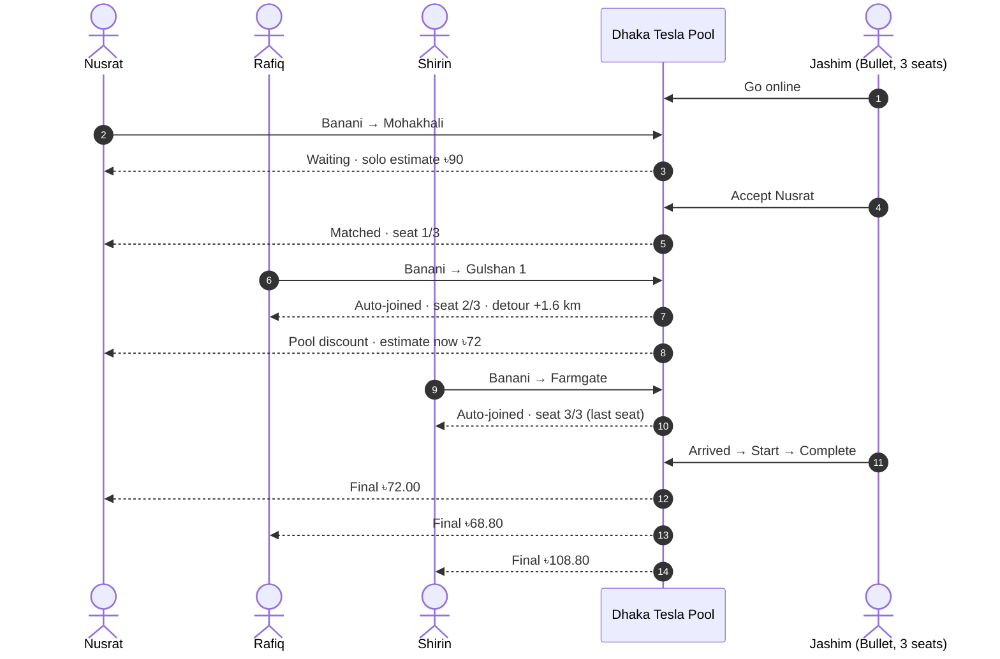
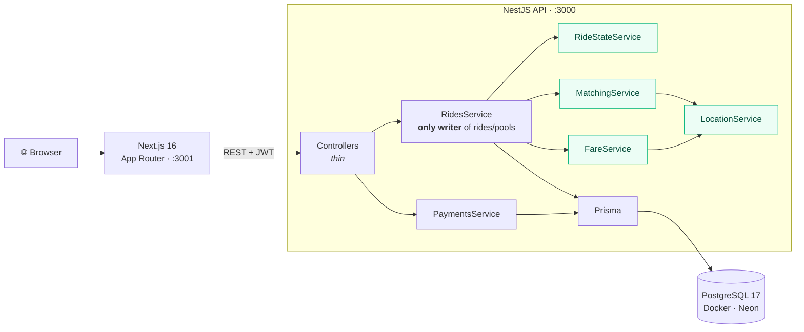
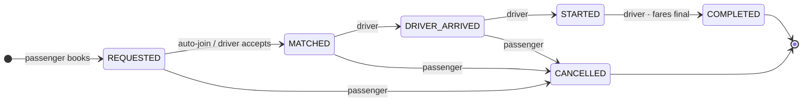
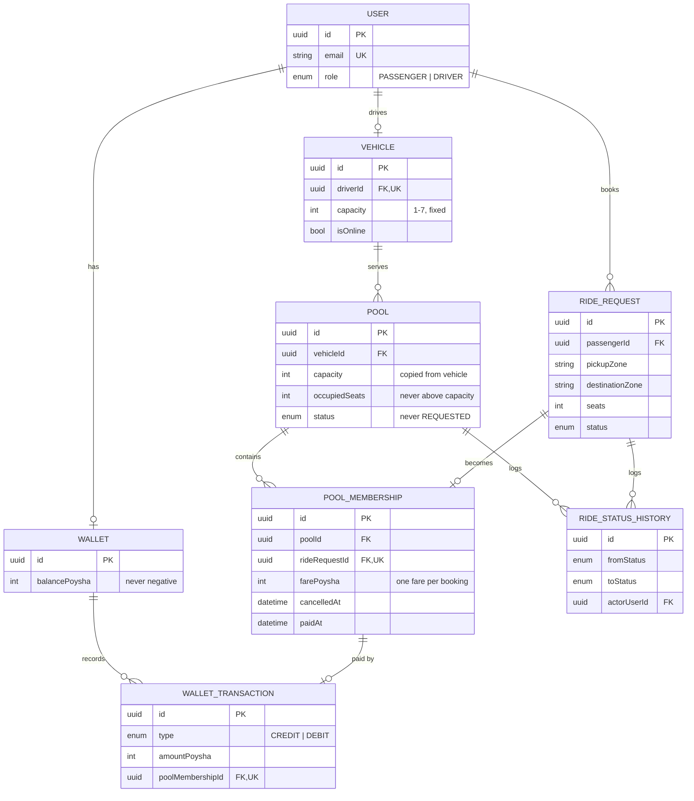
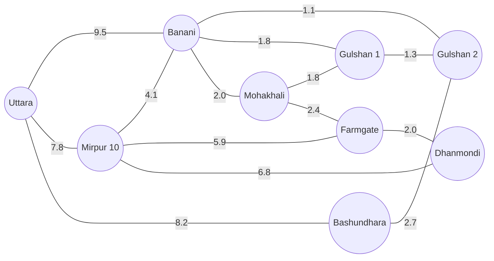
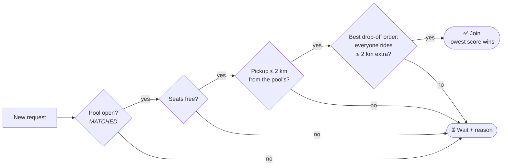
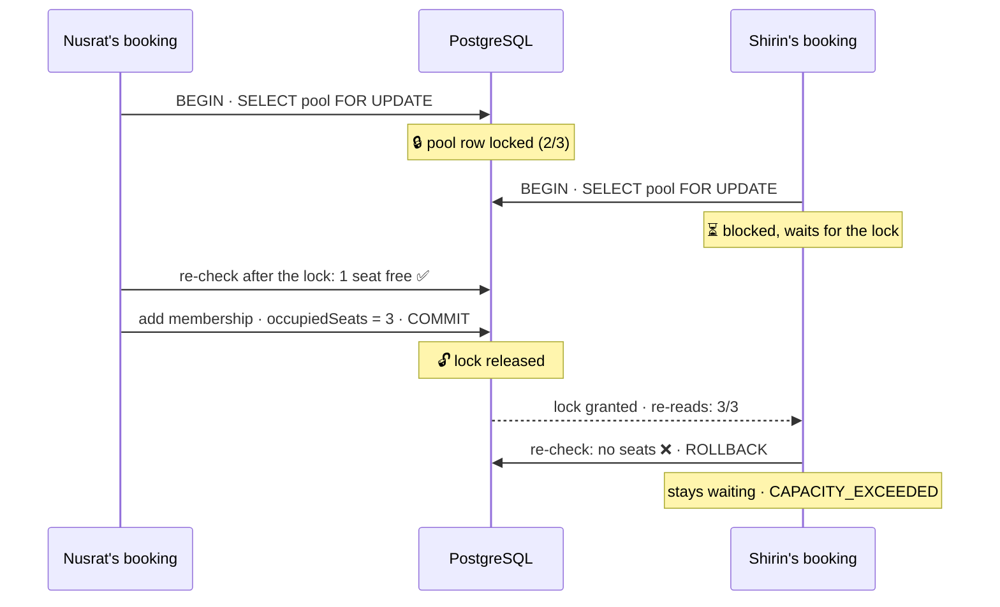
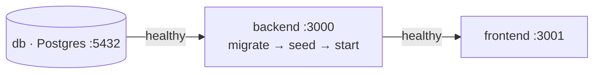
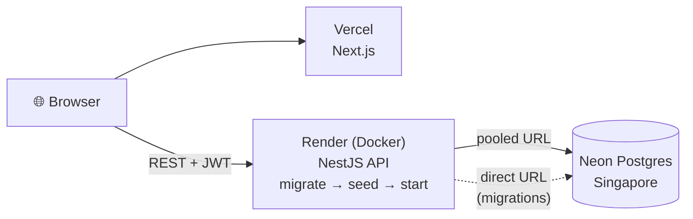
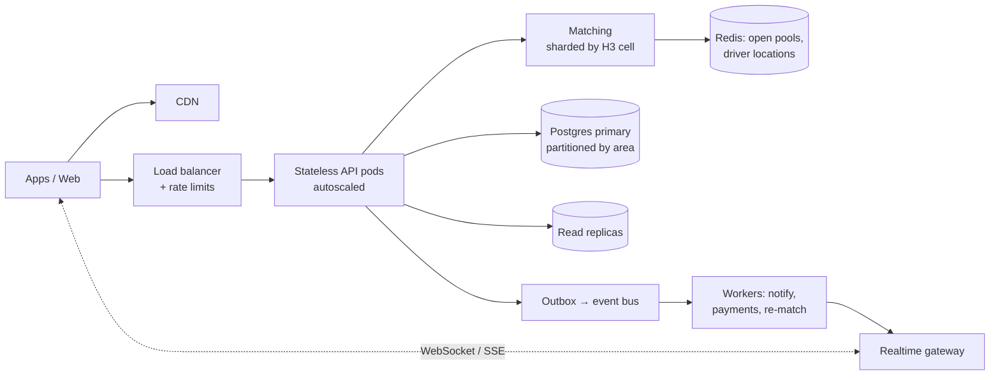

<div align="center">

# 🚗 Dhaka Tesla Pool

**Ride-pooling for one 3-seat Tesla in Banani.**
Passengers share a car heading their way, each pays **their own** fare,
and two people can **never** take the same last seat.


[**Live demo**](https://dhaka-tesla-pool.vercel.app) ·
[**API health**](https://dhaka-tesla-pool-api.onrender.com/health) ·
**Demo video:** _TODO_ ·
[**Run locally**](#-run-it) ·
[**Demo logins**](#-demo-logins)


</div>

---

## 📖 The story

> **8:41 AM, Banani.** Jashim waits with **Bullet**, his 3-seat Tesla.
> Nusrat books a ride to Mohakhali. Rafiq books an *overlapping but different* route to Gulshan 1.
> Shirin grabs the **last seat**, at the same moment as someone else.


```mermaid
sequenceDiagram
    autonumber
    actor N as Nusrat
    actor R as Rafiq
    actor S as Shirin
    participant App as Dhaka Tesla Pool
    actor J as Jashim (Bullet, 3 seats)

    J->>App: Go online
    N->>App: Banani → Mohakhali
    App-->>N: Waiting · solo estimate ৳90
    J->>App: Accept Nusrat
    App-->>N: Matched · seat 1/3
    R->>App: Banani → Gulshan 1
    App-->>R: Auto-joined · seat 2/3 · detour +1.6 km
    App-->>N: Pool discount · estimate now ৳72
    S->>App: Banani → Farmgate
    App-->>S: Auto-joined · seat 3/3 (last seat)
    J->>App: Arrived → Start → Complete
    App-->>N: Final ৳72.00
    App-->>R: Final ৳68.80
    App-->>S: Final ৳108.80
```

**What the system has to get right:**

| | Problem | How it's solved |
|:-:|---|---|
| 🤝 | Who can share a car? | [Matching rule](#-matching--fares): nobody rides more than **2 km extra** |
| 🔒 | Never overbook, even when two people book at once | [Row lock](#-the-last-seat-race) (`SELECT … FOR UPDATE`) plus a DB `CHECK` |
| 💸 | A fair price per person | [Individual fare](#-matching--fares) from **your own** trip, with a pool discount |
| 🔁 | A clear ride lifecycle | [State machine](#-ride-lifecycle): invalid steps are rejected with `409` |

---

## ✅ Brief checklist

| The brief asked for | Where |
|---|---|
| Passenger: sign up/in, request, estimate, track, history, cancel | [Features](#-features) |
| Driver: online/offline, fixed-capacity Tesla, accept, arrive/start/complete | [Features](#-features) |
| Pooling that never exceeds capacity | [Last-seat race](#-the-last-seat-race) · e2e race test |
| An individual fare per passenger, hand-checkable | [Fares](#-matching--fares) |
| Lifecycle `REQUESTED → MATCHED → DRIVER_ARRIVED → STARTED → COMPLETED` (+ `CANCELLED`) | [Lifecycle](#-ride-lifecycle) |
| Dhaka zones with lat/lng + a documented matching rule | [Matching](#-matching--fares) |
| Money as integers, and why | [Key decisions](#-key-decisions) |
| Architecture diagram + ERD | [Architecture](#-architecture) · [ERD](#-database) |
| Every stack choice justified: alternatives, when to switch | [Tech stack](#-tech-stack) |
| `docker compose up`, `.env.example`, migrations, seed with the story cast | [Run it](#-run-it) |
| Tests for capacity, transitions, fares, ownership, cancellation, concurrency | [Tests](#-tests) |
| Free-tier deployment | [Deployment](#-deployment) |
| Bonus: "if Oi Tesla goes viral" | [Scaling](#-bonus-if-oi-tesla-goes-viral) |
| AI usage section | [AI usage](#-ai-usage) |

---

## ✨ Features

| 🧍 Passenger · Nusrat, Rafiq, Shirin | 🚘 Driver · Jashim / Bullet |
|---|---|
| Book a ride: pickup, destination, seats | Add a Tesla (1–7 seats, fixed) |
| Live fare + distance preview before booking | Go online / offline (not mid-trip) |
| Auto-join a fitting pool, or wait with the **reason** shown | See waiting passengers that fit the free seats |
| Live status, seat map, co-riders' first names | Accept → creates the pool, or adds to it |
| **City map**: your path vs your direct line | **City map**: every passenger's path in their own colour |
| Own fare with breakdown: *Estimated* → *Final* | Arrived → Start → Complete (only the valid next step) |
| Cancel before the trip starts | Every passenger's fare + breakdown |
| Pay by cash or **TeslaPay** wallet | Trip history with totals |
| Ride history, wallet, toasts ("Rafiq joined") | Toasts when passengers join or cancel |

Also: light/dark mode, a collapsible sidebar, a bottom tab bar on phones, and loading, empty and error states on every screen.

### 📸 Screenshots

<!-- TODO: add images to assets/screenshots/ and replace the placeholders -->
| Passenger: request + preview | Passenger: pooled ride | Driver: dashboard + map | Driver: trip |
|:-:|:-:|:-:|:-:|
| _TODO_ | _TODO_ | _TODO_ | _TODO_ |

---

## 🏗 Architecture


```mermaid
flowchart LR
    B["🌐 Browser"] --> FE["Next.js 16<br/>App Router · :3001"]
    FE -- "REST + JWT" --> C

    subgraph API["NestJS API · :3000"]
        C["Controllers<br/><i>thin</i>"] --> RS["RidesService<br/><b>only writer</b> of rides/pools"]
        C --> PS["PaymentsService"]
        RS --> ST["RideStateService"]
        RS --> MS["MatchingService"]
        RS --> FS["FareService"]
        MS --> LS["LocationService"]
        FS --> LS
        RS --> PR["Prisma"]
        PS --> PR
    end

    PR --> DB[("PostgreSQL 17<br/>Docker · Neon")]

    classDef pure fill:#ecfdf5,stroke:#10b981,color:#064e3b
    class ST,MS,FS,LS pure
```

| Rule | Why |
|---|---|
| 🟩 **Pure deciders** (green): matching, fares, state rules and distances never touch the DB | Unit-tested with plain data, no database |
| ✍️ **One writer**: `RidesService` changes ride/pool state, in one transaction with row locks | Every race is handled in one place |
| 🪶 **Thin controllers**: validate the DTO, call one method | Business logic lives in services only |

### 🔁 Ride lifecycle


```mermaid
stateDiagram-v2
    direction LR
    [*] --> REQUESTED: passenger books
    REQUESTED --> MATCHED: auto-join / driver accepts
    MATCHED --> DRIVER_ARRIVED: driver
    DRIVER_ARRIVED --> STARTED: driver
    STARTED --> COMPLETED: driver · fares final
    REQUESTED --> CANCELLED: passenger
    MATCHED --> CANCELLED: passenger
    DRIVER_ARRIVED --> CANCELLED: passenger
    COMPLETED --> [*]
    CANCELLED --> [*]
```

- A **pool** is born at `MATCHED` when a driver accepts. It's never `REQUESTED`.
- Moving the pool moves every active member's request with it, in the same transaction.
- The last member cancelling cancels the pool. Anything else → `409 INVALID_TRANSITION`.

---

## 🗄 Database


```mermaid
erDiagram
    USER ||--o| VEHICLE : drives
    USER ||--o{ RIDE_REQUEST : books
    USER ||--o| WALLET : has
    VEHICLE ||--o{ POOL : serves
    POOL ||--o{ POOL_MEMBERSHIP : contains
    RIDE_REQUEST ||--o| POOL_MEMBERSHIP : becomes
    POOL ||--o{ RIDE_STATUS_HISTORY : logs
    RIDE_REQUEST ||--o{ RIDE_STATUS_HISTORY : logs
    WALLET ||--o{ WALLET_TRANSACTION : records
    POOL_MEMBERSHIP ||--o| WALLET_TRANSACTION : "paid by"

    USER {
        uuid id PK
        string email UK
        enum role "PASSENGER | DRIVER"
    }
    VEHICLE {
        uuid id PK
        uuid driverId FK, UK
        int capacity "1-7, fixed"
        bool isOnline
    }
    RIDE_REQUEST {
        uuid id PK
        uuid passengerId FK
        string pickupZone
        string destinationZone
        int seats
        enum status
    }
    POOL {
        uuid id PK
        uuid vehicleId FK
        int capacity "copied from vehicle"
        int occupiedSeats "never above capacity"
        enum status "never REQUESTED"
    }
    POOL_MEMBERSHIP {
        uuid id PK
        uuid poolId FK
        uuid rideRequestId FK, UK
        int farePoysha "one fare per booking"
        datetime cancelledAt
        datetime paidAt
    }
    RIDE_STATUS_HISTORY {
        uuid id PK
        enum fromStatus
        enum toStatus
        uuid actorUserId FK
    }
    WALLET {
        uuid id PK
        int balancePoysha "never negative"
    }
    WALLET_TRANSACTION {
        uuid id PK
        enum type "CREDIT | DEBIT"
        int amountPoysha
        uuid poolMembershipId FK, UK
    }
```

**Guardrails the database enforces itself**, added as raw SQL in the init migration:

| Guarantee | Constraint |
|---|---|
| Seats never exceed capacity | `CHECK (occupiedSeats <= capacity)` |
| One active pool per car | Partial unique index on `Pool(vehicleId)` |
| One active request per passenger | Partial unique index on `RideRequest(passengerId)` |
| A membership can't be paid by wallet twice | Unique `WalletTransaction.poolMembershipId` |
| The wallet never goes negative | `CHECK (balancePoysha >= 0)` |

<details>
<summary><b>Why each table exists</b></summary>

| Table | Why |
|---|---|
| `User` | One table with a `role`. Nobody needs to be both passenger and driver |
| `Vehicle` | One per driver; capacity is fixed at creation |
| `RideRequest` | A booking, matched or not. Carries the passenger's status |
| `Pool` | One trip on one car. `capacity` is **copied** so a one-table `CHECK` can guard seats |
| `PoolMembership` | Request ↔ pool link and the **only place a fare lives**. A cancel sets `cancelledAt`, never deletes |
| `RideStatusHistory` | Append-only: who changed what, from → to, when |
| `Wallet` / `WalletTransaction` | Simulated TeslaPay. Append-only CREDIT/DEBIT rows; the balance is a cached sum |

</details>

---

## 🧭 Matching & fares

**The city.** 9 Dhaka zones (real lat/lng) joined by 14 hand-picked roads. A trip's distance is the **shortest chain of roads**. The same number drives matching, fares and the map, and there's no maps API.


```mermaid
graph LR
    UTT((Uttara)) --- |9.5| BAN((Banani))
    UTT --- |7.8| MIR((Mirpur 10))
    UTT --- |8.2| BAS((Bashundhara))
    MIR --- |4.1| BAN
    MIR --- |5.9| FAR((Farmgate))
    MIR --- |6.8| DHA((Dhanmondi))
    BAS --- |2.7| GU2((Gulshan 2))
    BAN --- |1.1| GU2
    BAN --- |1.8| GU1((Gulshan 1))
    GU1 --- |1.3| GU2
    BAN --- |2.0| MOH((Mohakhali))
    MOH --- |1.8| GU1
    MOH --- |2.4| FAR
    FAR --- |2.0| DHA
```
<sub>km, rounded to 0.1</sub>

### 🤝 Can this passenger join the pool?


```mermaid
flowchart LR
    R["New request"] --> O{"Pool open?<br/><i>MATCHED</i>"}
    O -- yes --> S{"Seats free?"}
    S -- yes --> P{"Pickup ≤ 2 km<br/>from the pool's?"}
    P -- yes --> X{"Best drop-off order:<br/>everyone rides<br/>≤ 2 km extra?"}
    X -- yes --> J(["✅ Join<br/>lowest score wins"])
    O -- no --> W(["⏳ Wait + reason"])
    S -- no --> W
    P -- no --> W
    X -- no --> W
```

It tries every drop-off order (at most 3! = 6 for Bullet), so the result doesn't depend on who booked first.

| Nusrat's pool Banani → Mohakhali, then… | Worst extra | Result |
|---|:-:|:-:|
| Rafiq · Banani → Gulshan 1 | 1.63 km | ✅ |
| Shirin · Banani → Farmgate (pool = Nusrat + Rafiq) | 1.63 km | ✅ |
| Someone · Banani → Uttara (opposite way) | 3.94 km | ❌ `EXTRA_DISTANCE_TOO_HIGH` |

### 💸 Fare, per passenger

```
fare = ( ৳50 base  +  ৳20 × km  −  20% pool discount ) × seats
         └── km = YOUR OWN pickup → destination, rounded to 0.1 km (checkable by hand)
             discount applies when ≥ 2 bookings share the pool
```

| Passenger | Road km | Priced km | Base | Distance | Discount | **Fare** |
|---|:-:|:-:|:-:|:-:|:-:|:-:|
| Nusrat | 1.972 | 2.0 | ৳50.00 | ৳40.00 | −৳18.00 | **৳72.00** |
| Rafiq | 1.794 | 1.8 | ৳50.00 | ৳36.00 | −৳17.20 | **৳68.80** |
| Shirin | 4.348 | 4.3 | ৳50.00 | ৳86.00 | −৳27.20 | **৳108.80** |

The fare is stored at join as an **estimate**, then recomputed for everyone when the trip completes (**final**). Nusrat sees ৳90 alone, then ৳72 once Rafiq joins.

---

## 🔒 The last-seat race

Bullet has **1 seat left**. Nusrat and Shirin both see it free and book at the same instant.


```mermaid
sequenceDiagram
    participant N as Nusrat's booking
    participant DB as PostgreSQL
    participant S as Shirin's booking

    N->>DB: BEGIN · SELECT pool FOR UPDATE
    Note over DB: 🔒 pool row locked (2/3)
    S->>DB: BEGIN · SELECT pool FOR UPDATE
    Note over S: ⏳ blocked, waits for the lock
    N->>DB: re-check after the lock: 1 seat free ✅
    N->>DB: add membership · occupiedSeats = 3 · COMMIT
    Note over DB: 🔓 lock released
    DB-->>S: lock granted · re-reads: 3/3
    S->>DB: re-check: no seats ❌ · ROLLBACK
    Note over S: stays waiting · CAPACITY_EXCEEDED
```

- **Re-check after the lock.** Reading "1 seat free" *before* locking proves nothing.
- **Lock order:** always Vehicle → Pool → RideRequest, so there are no deadlocks.
- **Backstop:** even if the code were wrong, the `CHECK (occupiedSeats <= capacity)` makes Postgres refuse.
- **Proven:** an e2e test fires both requests together, 10 times, against a real Postgres.

<details>
<summary><b>Other races handled the same way</b></summary>

| Race | Guard |
|---|---|
| Two accepts of one request | Conditional `UPDATE … WHERE status = 'REQUESTED'` |
| Second pool on one car | Vehicle row lock + partial unique index |
| Go offline vs accept | Vehicle row lock |
| Cancel vs start | Pool row lock |
| Double payment | `paidAt IS NULL` condition + unique wallet transaction |

**At scale:** a pool has only a few seats, so contention on one pool row stays tiny. The bottleneck moves to matching reads. Fixes: geospatial candidate search, partitioning by area, `FOR UPDATE SKIP LOCKED`, and idempotency keys on booking and payment.

</details>

---

## 🎯 Key decisions

| Decision | Why | Trade-off |
|---|---|---|
| **Pessimistic `FOR UPDATE`**, not an optimistic `version` column | Racing for the last seat is the *expected* case; optimistic locking needs retries and the loser still loses | Joins on one pool run one at a time (fine: ≤ 7 seats) |
| **Integer poysha**, not decimal taka | Exact math, no float drift, the same pattern as Stripe's cents | Format only for display |
| **Capacity copied onto the pool** | A one-table `CHECK` can back up the lock, with no trigger | A denormalized copy; safe because capacity never changes |
| **Accepting creates the pool** | "Matched/accepted" is one event; a pool without a car makes no sense | No background re-matching of waiting requests |
| **2 km absolute detour**, every drop-off order tried | Trips here are ~2 km, so a % detour rejects everything, and booking order shouldn't change the answer | A simple rule, not an optimal route |
| **Hand-picked road network** | Deterministic, free, fares checkable by hand; only `LocationService` would change for a real routing API | Not real road geometry or traffic |
| **Price in 0.1 km steps** | Fares verifiable by hand, as the brief asks | ±0.05 km rounding |
| **Pure deciders + one writer** | Logic is unit-tested without a DB; all writes are in one place | More files than one big service |
| **5 s polling** | No socket infrastructure; easy to reason about | Up to 5 s lag |
| **JWT in `localStorage`** | Simple; the Bearer header means no CSRF | XSS could read it. Upgrade: an httpOnly cookie |

<details>
<summary><b>Assumptions</b> (the brief allows them when documented)</summary>

- Auto-joining an accepted pool needs no second approval from the driver.
- A pool closes to new riders at `DRIVER_ARRIVED`, which means "at the first pickup".
- Anyone can register as a driver. There's no cancellation fee.

</details>

---

## 🧰 Tech stack

The brief mandated Next.js/React, a Node.js backend and a database. Everything else is a choice:

| | Choice | Why it fits | Alternatives | Switch when |
|---|---|---|---|---|
| 🖥 Frontend | **Next.js 16** + React 19 | Recommended by the brief; file routes; `standalone` gives a small image | Vite SPA, Remix | Not at this size |
| 🎨 Styling | **Tailwind v4**, no UI kit | A few tokens + 5 components, light/dark | shadcn/ui, MUI | A real design system |
| ⚙️ Backend | **NestJS** | Modules, DI and guards give deciders vs writer a clear home | Express, Fastify | Raw throughput → Fastify adapter |
| 🗄 Database | **PostgreSQL 17** | Row locks, `CHECK`s and partial unique indexes *are* the solution | MySQL, MongoDB | Stays; scale with replicas |
| 🔗 ORM | **Prisma 7** | Typed client + migrations; `$queryRaw` for `FOR UPDATE` | Drizzle, TypeORM | Heavy raw SQL → Drizzle/Kysely |
| ✅ Validation | **class-validator** | Native to Nest's `ValidationPipe` | Zod | Shared FE/BE schemas → Zod |
| 🔑 Auth | **JWT** + **bcryptjs** | Stateless; pure JS, no native build | Sessions, argon2 | Production → httpOnly cookie + refresh |
| 🧪 Tests | **Jest** + supertest on **real Postgres** | Locks and constraints can only be proven on a real DB | Vitest, mocked Prisma | — |
| 📦 Containers | **Docker Compose** | One command runs all three services | Kubernetes | Many services → ECS/K8s |
| ☁️ Hosting | **Vercel · Render · Neon** | Free, no card; Render runs the same Dockerfile | Railway, Fly.io, Supabase | Cold starts matter → paid always-on |

---

## 🚀 Run it

**Prerequisite:** Docker Desktop. Nothing else is needed.

```bash
git clone <this repo> && cd Dhaka-Tesla-Pool
docker compose up --build
```


```mermaid
flowchart LR
    DB[("db · Postgres :5432")] -- healthy --> BE["backend :3000<br/>migrate → seed → start"]
    BE -- healthy --> FE["frontend :3001"]
```

Open **http://localhost:3001**. No `.env` is needed, because every variable has a local default. `docker compose down -v` resets the database.

<details>
<summary><b>Local development (hot reload, without Docker for the apps)</b></summary>

Needs Node.js 22.

```bash
docker compose up -d db            # Postgres only

cd backend
cp .env.example .env
npm install
npx prisma migrate deploy
npx prisma db seed
npm run start:dev                  # http://localhost:3000

cd ../frontend                     # second terminal
cp .env.example .env.local
npm install
npm run dev                        # http://localhost:3001
```

</details>

<details>
<summary><b>Environment variables</b></summary>

Every `.env.example` holds local-only values. Never commit real secrets.

| Variable | Used by | Purpose |
|---|---|---|
| `DATABASE_URL` | backend | App connection (pooled on Neon) |
| `DIRECT_URL` | backend | Migrations (direct connection) |
| `JWT_SECRET` / `JWT_EXPIRES_IN` | backend | Token signing key (a long random value outside your machine) / lifetime |
| `FRONTEND_ORIGIN` | backend | The one origin CORS allows |
| `NEXT_PUBLIC_API_URL` | frontend | API URL as the **browser** sees it. Baked in at build time |
| `POSTGRES_USER` / `_PASSWORD` / `_DB` | compose | The Postgres container |

</details>

<details>
<summary><b>Migrations & seed</b></summary>

- The init migration is Prisma's SQL **plus** hand-written `CHECK`s and partial unique indexes.
- The container runs `migrate deploy` (never `migrate dev`), then the seed.
- The seed is **idempotent** (upsert by email): Jashim + Bullet (3 seats, offline), and Nusrat, Rafiq and Shirin with ৳500 wallets each. No rides are seeded.

</details>

---

## 🔑 Demo logins

Password for everyone: **`password123`**. The sign-in page also has one-tap tiles for these accounts.

| | Who | Email | Starts with |
|:-:|---|---|---|
| 🚘 | Jashim | `jashim@teslapool.dev` | Bullet, 3 seats, offline |
| 🧍 | Nusrat | `nusrat@teslapool.dev` | ৳500 TeslaPay |
| 🧍 | Rafiq | `rafiq@teslapool.dev` | ৳500 TeslaPay |
| 🧍 | Shirin | `shirin@teslapool.dev` | ৳500 TeslaPay |

**Try the story.** Use one browser profile per person, because sessions are per browser.

1. Jashim goes **online**.
2. Nusrat books Banani → Mohakhali and **waits**.
3. Jashim **accepts**, which creates the pool.
4. Rafiq books Banani → Gulshan 1 and **auto-joins**; Nusrat's estimate drops from ৳90 to ৳72.
5. Shirin books Banani → Farmgate and takes the **last seat** (3/3).
6. Jashim marks arrived → start → complete. Final fares: **৳72.00 · ৳68.80 · ৳108.80**.
7. Everyone pays by cash or TeslaPay.

---

## 🧪 Tests

```bash
cd backend
npm test                                                   # unit: pure deciders, no DB
docker compose exec db createdb -U tesla tesla_pool_test   # once, from the repo root
npm run test:e2e                                           # e2e: real Postgres
```

| Brief requirement | Covered by |
|---|---|
| Bullet's capacity can never be exceeded | 🏁 **e2e race** × 10: exactly one of Nusrat/Shirin wins, `occupiedSeats = 3` |
| Invalid transitions are rejected | Unit: every pair. e2e: start before arrived, completing twice, cancelling after start |
| Nusrat's & Rafiq's pooled fares | Unit: 7200 / 6880 / 10880 poysha. e2e: ৳90 estimate → ৳72 final |
| Can't modify another user's ride | e2e: Rafiq can't read, cancel or pay Nusrat's ride; a second driver can't move Jashim's pool |
| Cancellation rules | e2e: seat released, the last member leaving cancels the pool |
| Concurrent requests can't corrupt capacity | The race test, with the DB `CHECK` as the backstop |
| Payments | e2e: double payment and an underfunded wallet are both rejected |

<sub>The e2e helper refuses to wipe any database whose name lacks `_test`.</sub>

---

## 🌍 Deployment


```mermaid
flowchart LR
    U["🌐 Browser"] --> V["Vercel<br/>Next.js"]
    U -- "REST + JWT" --> R["Render (Docker)<br/>NestJS API<br/>migrate → seed → start"]
    R -- "pooled URL" --> N[("Neon Postgres<br/>Singapore")]
    R -. "direct URL<br/>(migrations)" .-> N
```

All on free tiers, with no card. Pushing to `main` redeploys both hosts.

<details>
<summary><b>Deployment notes</b></summary>

- **Cold start:** Render's free tier sleeps after 15 min idle, and the first request takes ~50 s.
- **CORS** allows exactly one origin: `FRONTEND_ORIGIN` must equal the Vercel URL, with no trailing slash.
- **`NEXT_PUBLIC_API_URL`** is baked in at build time, so redeploy Vercel after changing it.
- **Reset the demo data:** reset the Neon branch, then redeploy Render so it migrates and seeds again.

</details>

---

<details>
<summary><h2>📡 API overview</h2></summary>

REST + JSON. Bearer JWT on everything except register, login and health. Money is always **integer poysha**.

| Endpoint | Role | Purpose |
|---|---|---|
| `POST /auth/register` · `/auth/login` · `GET /auth/me` | public / any | `{ accessToken, user }` |
| `POST /vehicles` · `GET /vehicles/me` · `PATCH /vehicles/me/status` | driver | Tesla, active pool, online/offline |
| `POST /ride-requests` | passenger | Book; auto-joins if a pool fits. Always `201`, with the reason when waiting |
| `GET /ride-requests/me` · `/:id` | passenger | History; one ride with fare, pool and waiting reason |
| `PATCH /ride-requests/:id/cancel` | owner | Before `STARTED`; releases seats |
| `GET /ride-requests/pending` · `PATCH /:id/accept` | driver | Waiting requests that fit; create or join the pool |
| `GET /pools/me` · `/pools/:id` · `/history` · `/fares` | driver / member | Trips, route stops, status log, fare breakdowns |
| `PATCH /pools/:id/arrived \| start \| complete` | pool's driver | Lifecycle; `complete` finalizes fares |
| `GET /fares/estimate` | passenger | A quote before booking |
| `POST /payments/:membershipId` · `GET /wallet/me` | passenger | Cash or wallet after `COMPLETED`; balance |
| `GET /health` | public | `{ status, db }` or `503` |

**Errors:** `{ "statusCode": 409, "error": "CAPACITY_EXCEEDED", "message": "…" }`. The UI switches on `error`, never on `message`.
**Ownership** is checked in the service, inside the same transaction as the write.

</details>

<details>
<summary><h2>📁 Project structure</h2></summary>

```
Dhaka-Tesla-Pool/
├── docker-compose.yml        db + backend + frontend
├── backend/                  NestJS
│   ├── prisma/               schema, migrations (+ raw SQL guards), seed
│   ├── src/common/           JWT + roles guards, error filter
│   ├── src/modules/
│   │   ├── auth/  vehicles/  health/
│   │   ├── location/         zones + roads, shortest paths
│   │   ├── fares/            FareService (pure)
│   │   ├── rides/            RidesService (writer) · matching + state machine (pure)
│   │   └── payments/         cash / wallet
│   └── test/                 e2e on real Postgres (last-seat race, rules, read views)
└── frontend/                 Next.js
    ├── app/                  (auth) · passenger/{dashboard,request,history,wallet} · driver/{dashboard,ride,trips}
    ├── components/           ui/ · ride/ (maps, seat map, stepper, timeline) · forms/ · app-shell
    ├── hooks/use-api.ts      fetch + 5 s polling
    └── lib/                  api client, session, zones, types
```

</details>

<details>
<summary><h2>🚧 Limitations & next steps</h2></summary>

| Known limitation | Next improvement |
|---|---|
| 9 zones, straight-line roads, no traffic | Real routing (OSRM) behind `LocationService`, the only piece that changes |
| Updates come every 5 s by polling | SSE / WebSockets |
| Waiting requests never expire; no background re-matching | Expiry + a re-matching worker |
| Pickups follow join order; "arrived" covers the whole pool | Per-passenger pickups (en-route pooling) |
| Cash is recorded, not confirmed; driver not credited; no top-up | Driver earnings + payouts |
| JWT in `localStorage`, no refresh tokens | httpOnly cookie + refresh, auth rate limiting |
| No idempotency keys | `Idempotency-Key` on booking and payment |
| No CI | GitHub Actions: lint + unit + e2e on a Postgres service; Playwright |

</details>

## 📈 Bonus: if Oi Tesla goes viral

*1M passengers, 100k drivers. This is reasoning, not built.*


```mermaid
flowchart LR
    Apps["Apps / Web"] --> CDN["CDN"]
    Apps --> LB["Load balancer<br/>+ rate limits"]
    LB --> API["Stateless API pods<br/>autoscaled"]
    Apps <-. "WebSocket / SSE" .-> RT["Realtime gateway"]
    API --> M["Matching<br/>sharded by H3 cell"]
    API --> PG[("Postgres primary<br/>partitioned by area")]
    API --> RR[("Read replicas")]
    M --> C[("Redis: open pools,<br/>driver locations")]
    API --> O["Outbox → event bus"]
    O --> W["Workers: notify,<br/>payments, re-match"]
    W --> RT
```

<details>
<summary><b>How each concern is handled</b></summary>

| Concern | Approach |
|---|---|
| Scale out | Stateless JWT API behind a load balancer, autoscaled; static assets on a CDN |
| Database | Hot-path indexes, read replicas for history, PgBouncer, partitioning by city/area |
| Contention | Short transactions, one pool row per join, `SKIP LOCKED` across candidate pools |
| Geo search | PostGIS / H3 cells instead of 9 zones; live driver locations |
| Matching | Sharded by area, 1–2 s batching windows, still re-checked under the lock |
| Caching | Redis for open pools + locations (short TTL); the DB stays the source of truth for seats |
| Events | Transactional outbox → workers for notifications, receipts, re-matching |
| Real-time | WebSocket/SSE gateway + push notifications |
| Safety | Rate limits, idempotency keys, retries with backoff, dead-letter queues |
| Observability | Request-ID logs, match rate, lock wait, p95, OpenTelemetry, SLO alerts |
| Security | httpOnly cookies, driver KYC, a secrets manager, least-privilege DB roles |
| Deploy | ECS/K8s, blue-green or canary, expand/contract migrations, IaC |

</details>

---

## 🤖 AI usage

_TODO: fill in. This is graded on engineering understanding, not on how little AI was used._

| | |
|---|---|
| **Tools** | _TODO: which tools, and what for (design review, code, tests, docs, debugging)_ |
| **Accepted** | _TODO: a suggestion I kept, why, and how I verified it_ |
| **Rejected / changed** | _TODO: a suggestion that was wrong, and what I did instead_ |
| **Staying in control** | _TODO: e.g. reviewed every change, one feature per commit, ran the tests myself_ |

<!-- Candidates from this project's history, if they match your experience:
     Accepted: pessimistic FOR UPDATE + re-check after the lock (vs an optimistic version column);
               copying capacity onto Pool so a single-table CHECK backs up the lock.
     Rejected: first matching draft ("detour ≤ 20% of the pool's route") rejected Nusrat + Rafiq (83%)
               and depended on booking order → replaced by the 2 km rule over every drop-off order;
               Prisma's `latest` tag pulled an 8.0 release candidate → pinned to 7.10. -->
